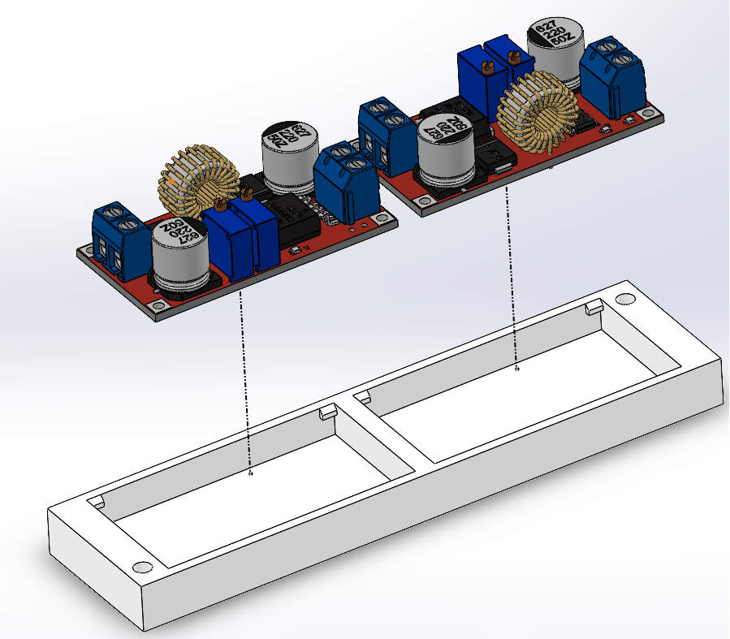
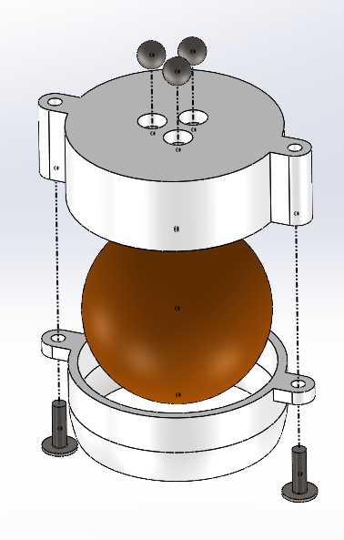
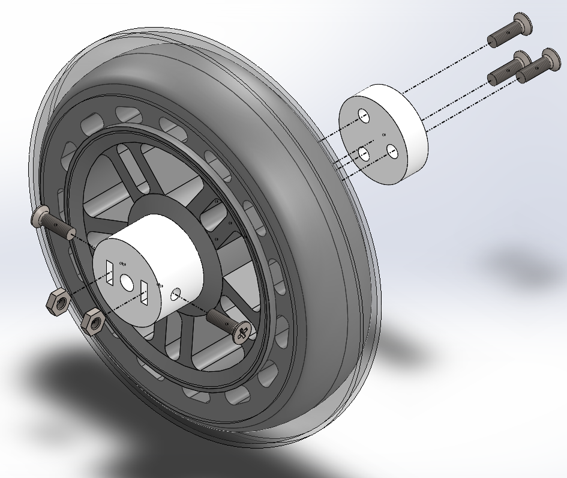
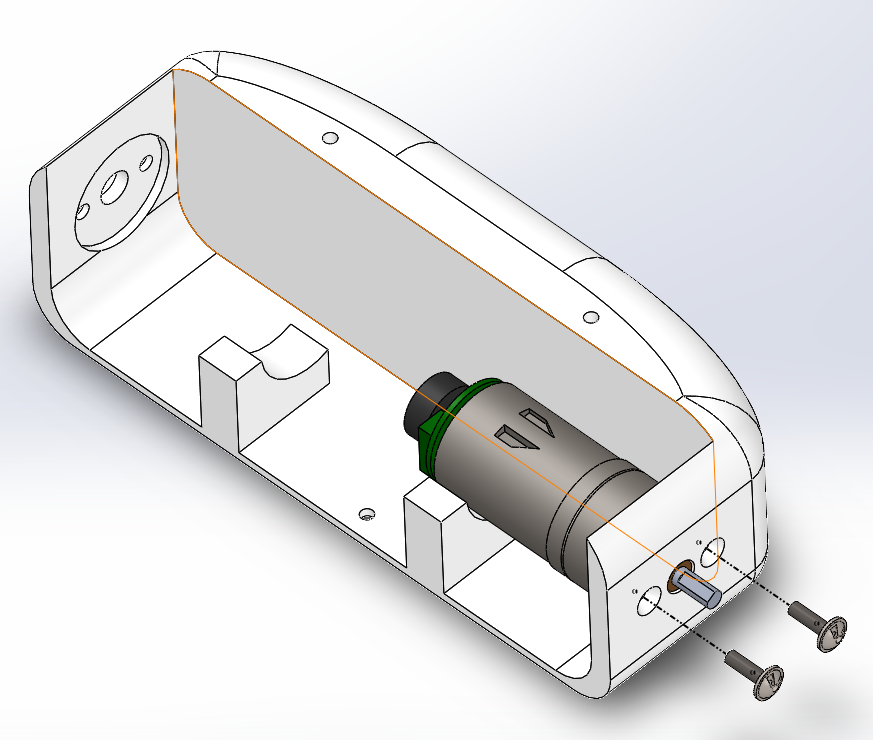
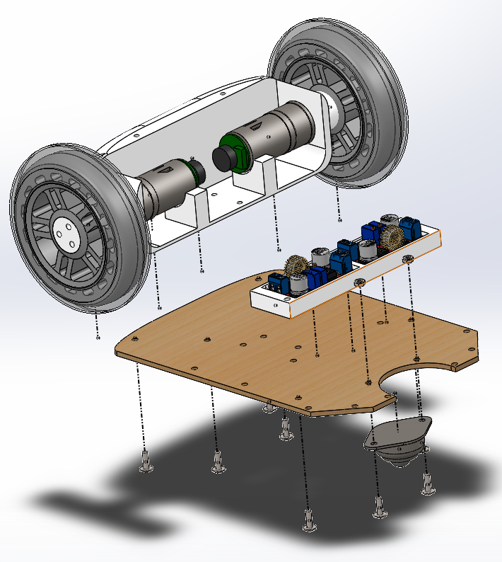
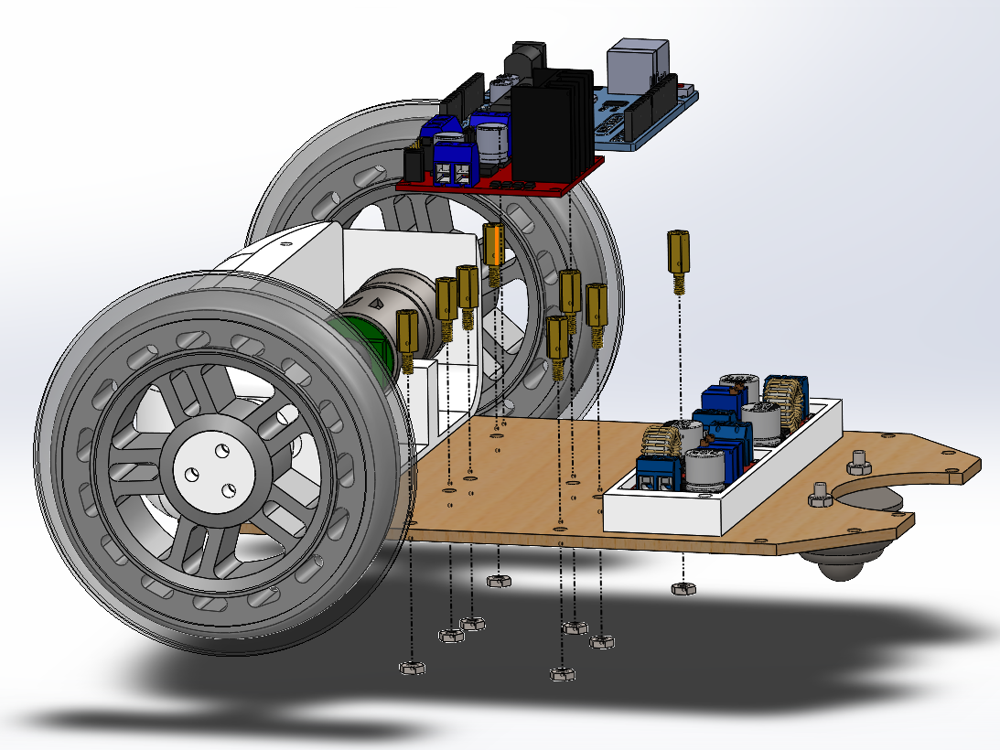
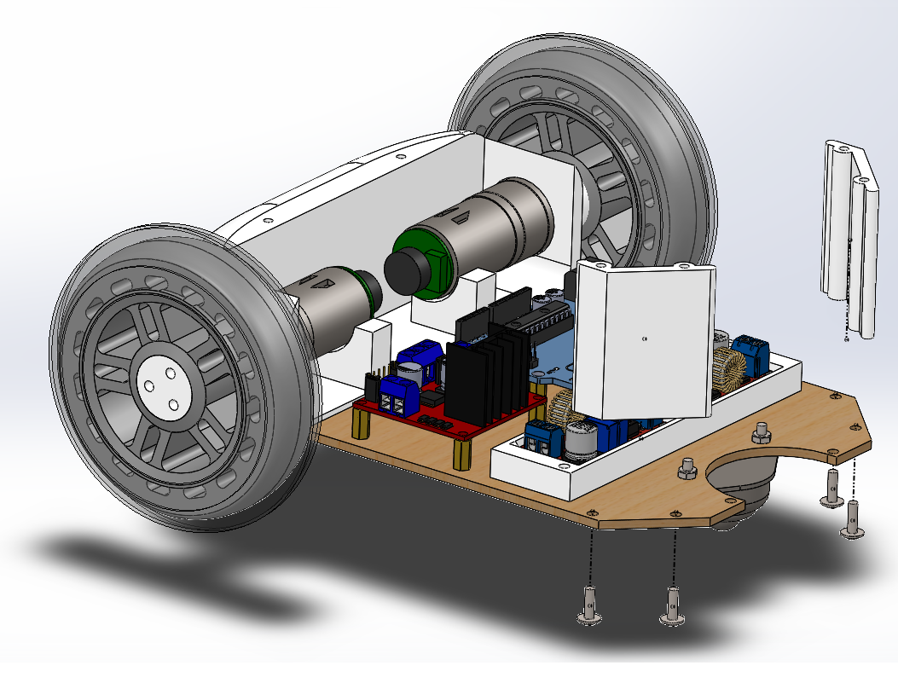
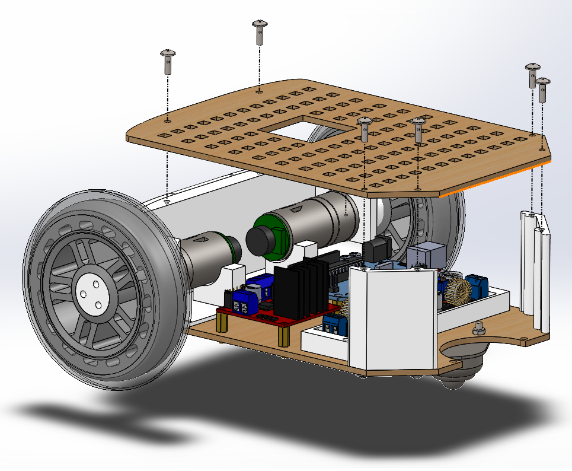
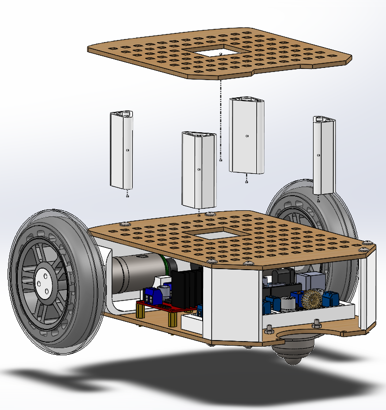

# Mechanics assembly

## Table of Contents

- [Mechanics assembly](#mechanics-assembly)
  - [Table of Contents](#table-of-contents)
  - [About ](#about-)
  - [Parts required ](#parts-required-)
  - [Electronics ](#electronics-)
    - [Assembly of smps holder ](#assembly-of-smps-holder-)
  - [Mechanics ](#mechanics-)
    - [Assembly of Caster joint ](#assembly-of-caster-joint-)
    - [Assembly of wheel adapter ](#assembly-of-wheel-adapter-)
    - [Assembly front ](#assembly-front-)
    - [Assembly base ](#assembly-base-)

----------

## About 

This file lists all the necessary steps in order to assembly the mechanics of the robot.

----------

## Parts required 

In order to build the robot you will need some 3D printed parts, some laser cut parts and some vitamins (parts that must be bought). All the models are inside **3D_model**. 
the files required for materialization are available [here](../3D_model/forConstruction/). In case you need to modify the parts to suit your requirements you can have access to the designs in the [case](../3D_model/case/) section. The designs were made on SolidWorks 2019

You can see that all the parts are grouped into folders. Each folder represent a type of piece that is needed to build the robot. You will need at least one piece of each folder in to build it. multiple designs will be implemented and stored on the same folders. In order to identify the right piece for your project, look for the same project name, for example **_generic** or **_noah** (most of the parts of the same type are interchangeable). 

The most biggest parts (base, top and shelf) are designed to be laser cut but it was also provided the files for 3D printing.

3D printed elementary parts:

|Parts              | Quantity | 
|-------------------|----------|
| front             |    1    |
| C000              |    1    |
| C001              |    1    |
| Adapter1          |    2    |
| Adapter2          |    2    |
| base_generic      |    1    |
| top_generic       |    1    |
| shelf             |    1    |
| back_left         |    1 	  |
| back_right        |    1 	  |
| SMPS_support      |    1 	  |
| spacer50mm        |    4 	  |

If you are going to use Noah board V2:

|Parts              | Quantity | 
|-------------------|----------|
| pcb_holder        |    1    |
| power_button      |    1    |

These are the vitamins, parts that are neither printed nor laser cut.
 
|Parts              | Quantity | 
|-------------------|----------|
| 10mm M3 screw     |    34    |
| 10mm M3 washer    |    34    |
| 10mm M3 nut       |    12    |
| 10mm M3 separator |    6     |
| 100mm roller wheel |   2     | 
| mad ball           |   1     | 

----------

## Electronics 

----------

### Assembly of smps holder 

</a>

----------

## Mechanics 

----------

### Assembly of Caster joint 

</a>

### Assembly of wheel adapter 

</a>

### Assembly front 

</a>

### Assembly base 

</a>

</a>

</a>

</a>

</a>