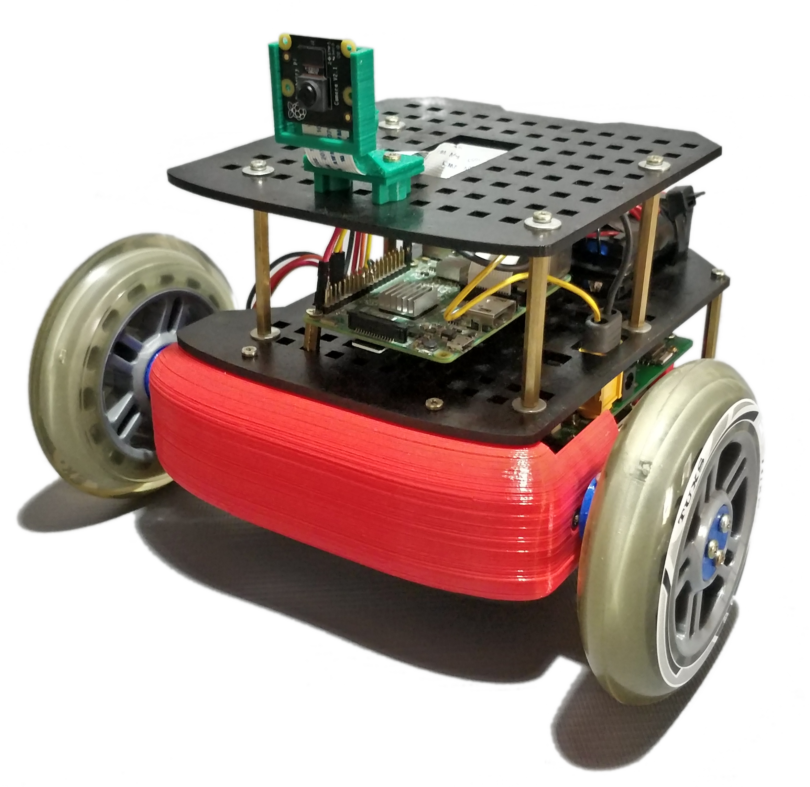
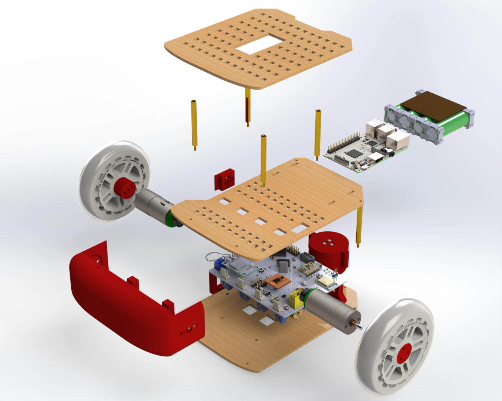
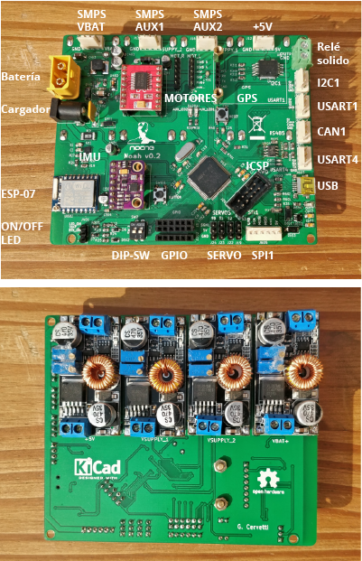

<p align="center">
  <a href="" rel="noopener">
 </a>
</p>

<h3 align="center">Noah Hardware</h3>

<div align="center">

[]()
[](/LICENSE)

</div>

---
This repo contains all the necessary hardware for noah-robot. 

## Table of Contents

- [Table of Contents](#table-of-contents)
- [About](#about)
- [Mechanics](#mechanics)
- [Electronics](#electronics)
- [Firmware](#firmware)
- [Videos](#videos)
- [Clone the repo](#clone-the-repo)
- [Authors](#authors)

## About

As a final thesis project of Electronics engineering, I decided to build a robot from scratch. All the design was made in order to build the robot with parts that can be bought in Argentina.

Take a look to the other repos related to this project:

- [noah-software](https://github.com/GonzaCerv/noah-software).
- [noah-docker](https://github.com/GonzaCerv/noah-docker).

## Mechanics

 </a>

The robot is made out of 3D printed parts, some parts made with 3mm laser cut and vitamins. All the parts were designed with Solidworks. You can find those parts as well as files for construction in the [3D model section](./noah-hardware\Doc\3D_model).

Checkout the [Assembly file](Doc/Assembly.md) to learn how to build this robot.

## Electronics

</a>

The main PCB is in charge of controlling all the peripherals of the robot. You can see in the pictures a all the connectors available. Several modules were provided:

- NEO6VM - GPS
- GY91 - IMU + Compass + Barometer + Temperature sensor
- ESP07 - Wifi module
- TB6612FGN - Dual full H bridge.

At the bottom there are 4 SMPS modules installed. They are capable of delivering up to 5A per channel.

The PCB was designed with Kicad. Take a look to the [PCB section](./noah-hardware\Doc\PCB).

## Firmware

The STM32F407VG was choseen as the main controller of this board. It runs at 72Mhz, enough to manage the 4 main FreeRTOS tasks that are currently coded:

- PID control loop for left motor.
- PID control loop for right motor.
- Comms task: provides communication between this layer and the ROS layer.
- Power management: small task in charge of managing the energy of the power supplies.

This project uses [STM32CubeIde](https://www.st.com/en/development-tools/stm32cubeide.html).

## Videos

- [Exploded view of the robot](https://youtu.be/NDaXydzkYNs)
- [Working demo of the robot](https://youtu.be/hgb2TbaiBBA)

## Clone the repo

- Install LFS in your machine:
  
  ```bash
  git lfs install
  ```

- clone the repo:
  
  ```bash
  git clone git@github.com:GonzaCerv/noah-hardware.git
  ```

## Authors

- [Gonzalo Cervetti](https://github.com/GonzaCerv) - Idea & Initial work
